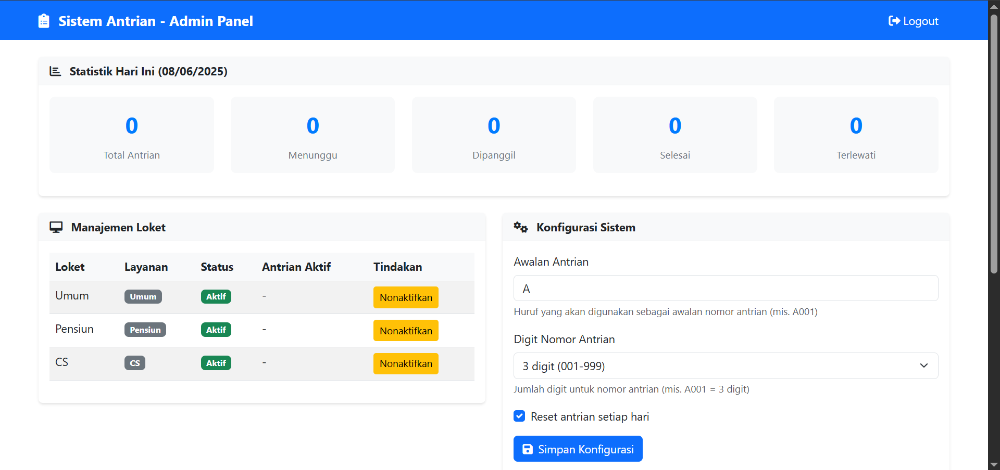
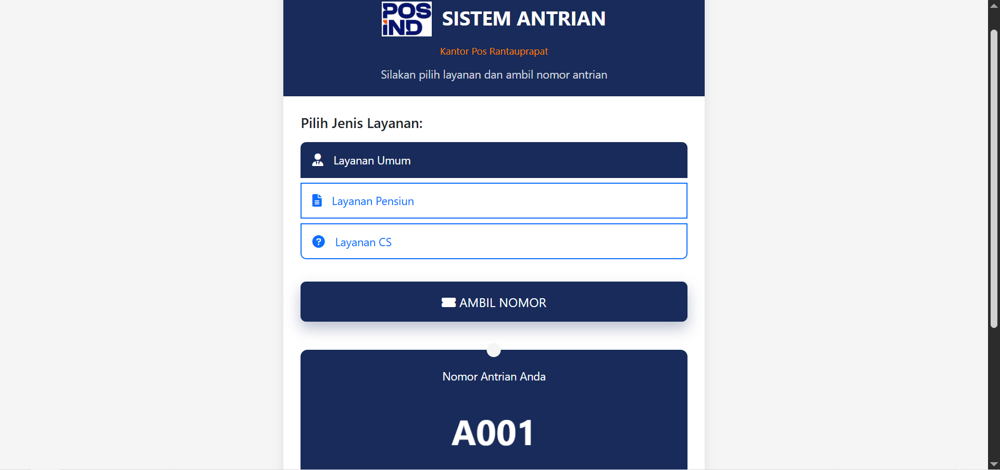
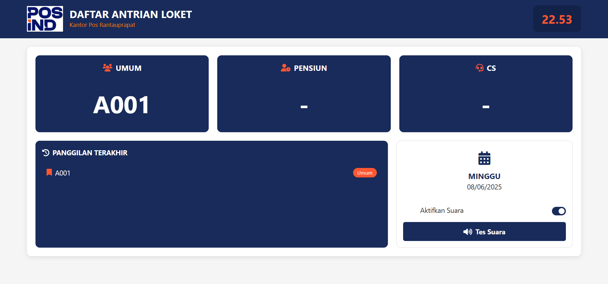
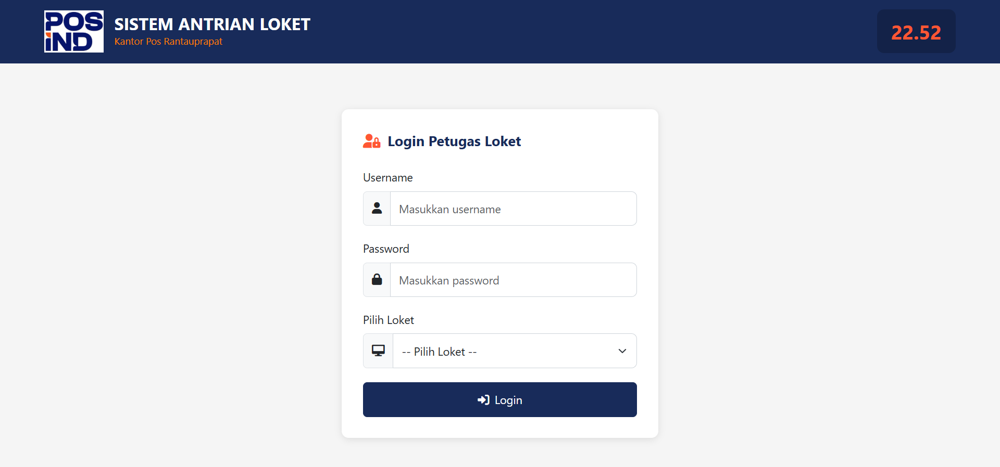
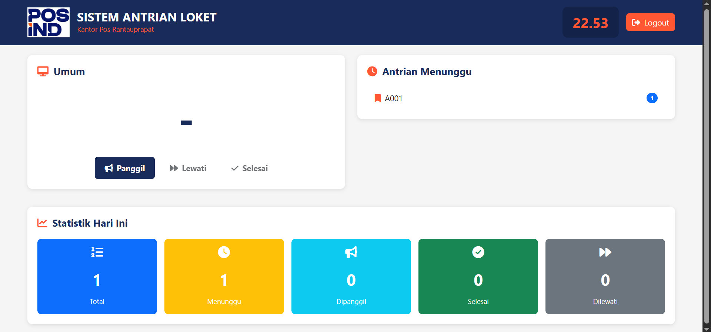

# Sistem Antrian CRUD dengan MySQL

Proyek ini adalah sistem antrian berbasis web yang menggunakan PHP dan MySQL. Sistem ini memiliki fitur:
- Pengambilan antrian
- Display antrian
- Login admin dan loket
- Pengelolaan data antrian

## 📸 Tampilan Aplikasi

### 1. Halaman Admin

### 2. Halaman Ambil Antrian

### 3. Halaman Display Antrian

### 4. Login Loket

### 5. Halaman Loket

## ⚙️ Teknologi yang Digunakan
- PHP Native
- MySQL
- HTML/CSS
- JavaScript

## 📂 Struktur Folder Penting
- `/screenshot`: berisi gambar tampilan aplikasi
- `/admin`: halaman untuk admin mengelola data
- `/loket`: halaman untuk petugas loket
- `/display`: halaman layar display antrian

## 🧑‍💻 Author
- Rizky Ramadhan Hasan Lubis ([@rizkysln](https://github.com/rizkysln))

---

Feel free untuk fork, clone, atau kasih bintang ⭐ kalau suka proyek ini!
